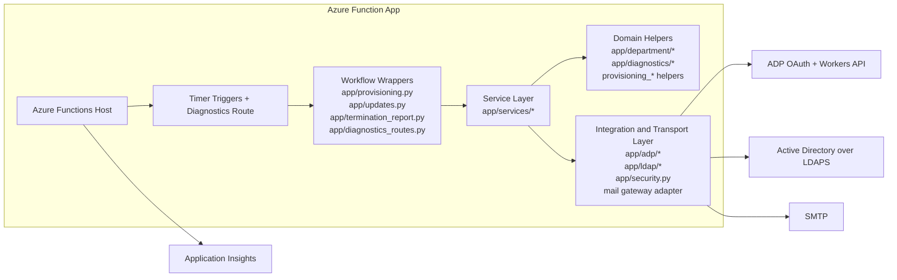
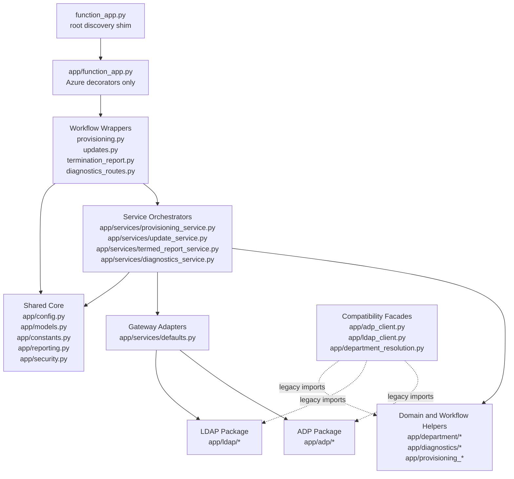
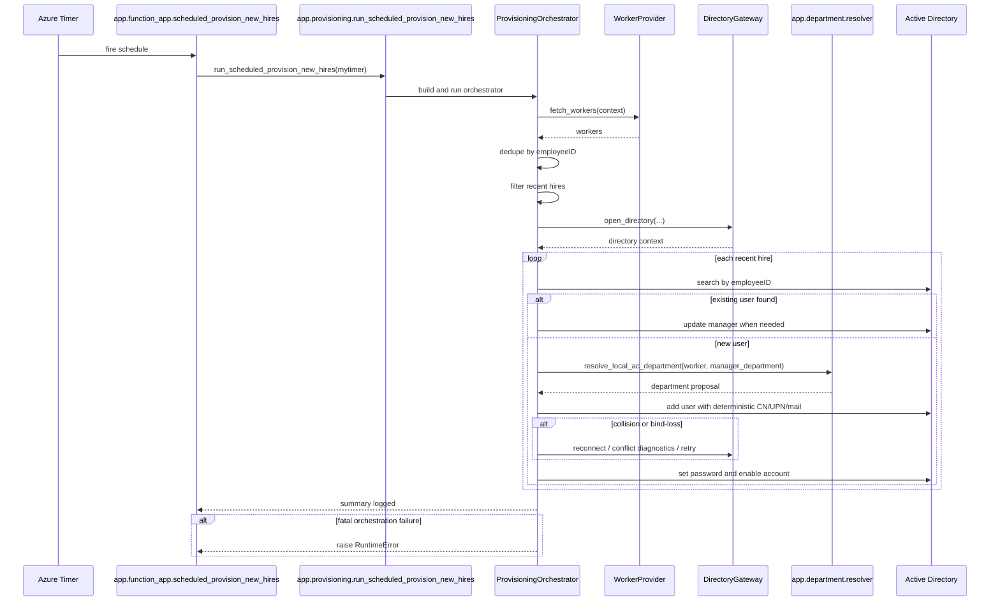
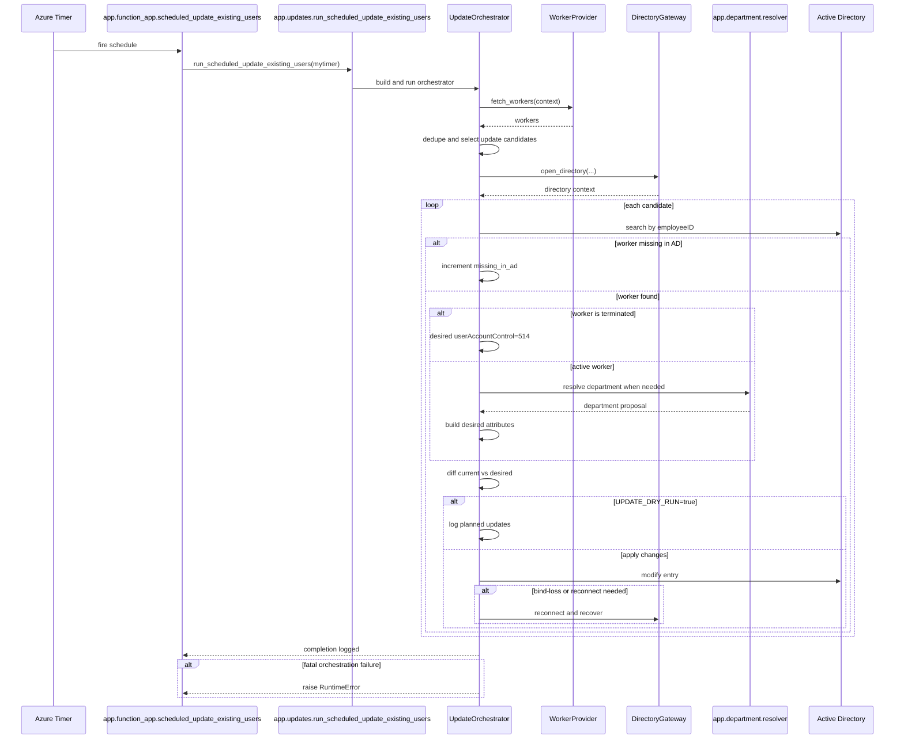
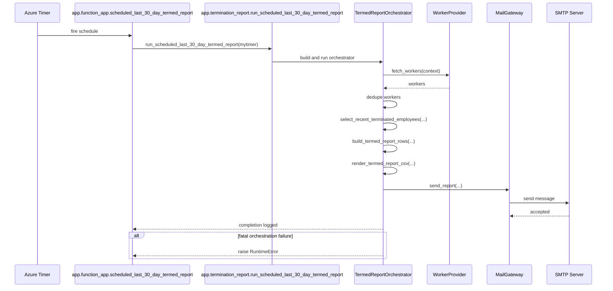
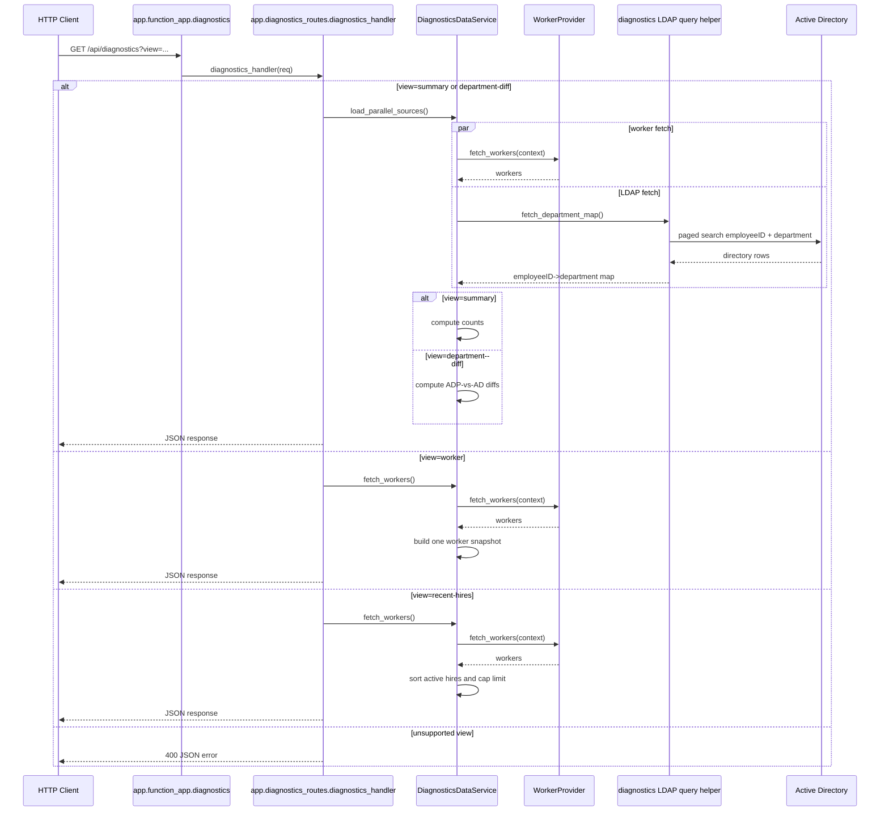

# Architecture

## System

This repository is a Python Azure Functions application that synchronizes ADP Workforce Now worker data into on-prem Active Directory over LDAPS.

The app exposes four runtime entrypoints:

- `scheduled_provision_new_hires`: provisions recent hires into AD
- `scheduled_update_existing_users`: compares ADP records to existing AD users and applies attribute updates
- `scheduled_last_30_day_termed_report`: emails a weekly CSV of recent ADP terminations
- `GET /api/diagnostics`: serves controlled, read-only diagnostics views for summary, department diffs, worker lookup, and recent hires

External integrations:

- ADP OAuth token endpoint and workers API
- LDAP / Active Directory over TLS
- SMTP for the termed report
- Azure Functions host and Application Insights logging

There is no application database in this repo. Each invocation re-fetches source data, computes a working set in memory, performs LDAP writes or emits a report, and exits.

## Runtime Model

Azure Functions discovers the root `FunctionApp` from the repo-level shim in [`function_app.py`](../function_app.py). The implementation lives in [`app/function_app.py`](../app/function_app.py).

Runtime host configuration is minimal and standard in [`host.json`](../host.json):

- `host.json` schema version `2.0`, which is the standard host format for Azure Functions runtime 2.x and later
- Application Insights sampling
- Extension bundle `Microsoft.Azure.Functions.ExtensionBundle`

Trigger wiring is intentionally thin. [`app/function_app.py`](../app/function_app.py) binds schedules and the diagnostics route, then delegates immediately into orchestration modules.

Current schedules:

- provisioning every 15 minutes, `run_on_startup=False`
- update hourly
- termed report on `TERMED_REPORT_SCHEDULE`, default `0 0 14 * * 1`
- diagnostics exposed as `GET /api/diagnostics` with Microsoft Entra App Service authentication, deployment-time main-site IP allowlisting, and an in-app platform-auth header check when enabled

## Architecture Decisions

- The sync is stateless and polling-oriented. There is no application database, queue, or persisted cursor.
- ADP is the source of truth for worker lifecycle state and upstream HR attributes consumed by this app. Active Directory is the managed projection target.
- `employeeID` is the canonical cross-system identity key.
- Azure-specific trigger and route concerns stop at the decorated entrypoints. Workflow sequencing lives in service orchestrators, and transport logic lives in focused ADP and LDAP packages.
- Update behavior is safe by default because `UPDATE_DRY_RUN=true` unless an environment explicitly disables it.
- Diagnostics is intentionally read-only and bounded to explicit query modes rather than acting as a general-purpose worker or directory browser.
- Some historical names still include `azuread`, but the runtime target described in this repository is on-prem Active Directory over LDAPS rather than Entra ID.

## Quick Reference

| Entrypoint | Trigger | Default schedule or auth | Reads from | Writes to | Primary output |
| --- | --- | --- | --- | --- | --- |
| `scheduled_provision_new_hires` | Timer | every 15 minutes | ADP, LDAP | LDAP | new AD users, manager links, enabled accounts |
| `scheduled_update_existing_users` | Timer | hourly, `UPDATE_DRY_RUN=true` by default | ADP, LDAP | LDAP when dry run is disabled | logged attribute diffs or applied attribute changes |
| `scheduled_last_30_day_termed_report` | Timer | `TERMED_REPORT_SCHEDULE`, default `0 0 14 * * 1` | ADP | SMTP | emailed CSV report |
| `GET /api/diagnostics` | HTTP GET | Entra App Service auth + deployed main-site IP allowlist | ADP, optional LDAP depending on `view` | none | bounded JSON diagnostics payload |

## Key Invariants

- `employeeID` is the canonical join key across ADP and Active Directory.
- Diagnostics code paths are read-only and do not call LDAP write helpers.
- Update sync never mutates create-time-only routing identifiers such as `mail`, `userPrincipalName`, `mailNickname`, `proxyAddresses`, or `targetAddress`.
- Timer runs recompute desired state from external systems instead of relying on local persisted state.
- Fatal orchestration failures are surfaced as failed Azure Functions invocations rather than being treated as successful no-op runs.

## Architecture Map

### System Context Map

This map is the highest-level runtime view: Azure Functions receives timer or HTTP events, wrapper modules hand off immediately to service orchestration, and the service layer coordinates domain rules plus ADP, LDAP, and SMTP transport boundaries.

### Code Layer Map

The key boundary is `wrappers -> services -> adapters/packages`. The wrappers stay Azure-specific, the services own workflow sequencing, and the adapter plus package layers own transport details and normalization logic.

## Runtime Topology

- The repository deploys one Azure Function App target, `adp-to-azuread`, and the runtime surface is limited to three timer triggers plus one HTTP diagnostics route.
- The current deployment target is Azure Functions Flex Consumption. The deployment workflow uses remote build so Python dependencies are built during deployment and function indexing remains intact in Azure.
- Because the deployment target is Flex Consumption, the deployed diagnostics authentication path uses Microsoft Entra App Service authentication with managed identity federated credentials rather than App Service certificate-based auth.
- Outbound dependencies are ADP HTTPS with mTLS client certificate material, LDAPS to on-prem Active Directory, SMTP for report delivery, and Azure-native logging/telemetry via the Functions host and Application Insights.
- The repository does not declare or provision network topology. Reachability to on-prem AD, private DNS, firewall rules, and any hybrid/VNet connectivity are environment-owned prerequisites.
- There is no application-side durable storage. The only durable state lives in ADP, Active Directory, SMTP mailboxes, and Azure platform telemetry.
- Certificate and key material are supplied as environment values and materialized to temp files on demand for the worker process lifetime through [`app/security.py`](../app/security.py).
- The diagnostics route is the only inbound HTTP surface exposed by application code.
- In deployed environments, the main site is intended to be IP-allowlisted while the SCM site remains separately reachable for deployment workflows.

## Code Layout

| Layer | Primary modules | Responsibility |
| --- | --- | --- |
| Entrypoints | [`function_app.py`](../function_app.py), [`app/function_app.py`](../app/function_app.py) | Azure Functions discovery plus decorated trigger and route wiring only |
| Core | [`app/config.py`](../app/config.py), [`app/models.py`](../app/models.py), [`app/constants.py`](../app/constants.py), [`app/reporting.py`](../app/reporting.py) | typed settings, shared constants, and run-summary helpers |
| Security | [`app/security.py`](../app/security.py) | certificate/key materialization, CA bundle resolution, and deterministic temp-file cleanup |
| ADP integration | [`app/adp/`](../app/adp), [`app/adp_client.py`](../app/adp_client.py) | ADP auth, mTLS, retries, pagination, dedupe, and worker parsing |
| LDAP integration | [`app/ldap/`](../app/ldap), [`app/ldap_client.py`](../app/ldap_client.py) | bind/search/modify transport, update planning, reconnect recovery, and write-scope enforcement |
| Department rules | [`app/department/`](../app/department), [`app/department_resolution.py`](../app/department_resolution.py), [`docs/department-resolution-v2.md`](./department-resolution-v2.md) | canonical department mapping, confidence rules, and guardrails |
| Diagnostics projections | [`app/diagnostics/`](../app/diagnostics), [`app/diagnostics_routes.py`](../app/diagnostics_routes.py) | read-only diagnostics views and HTTP controller logic |
| Services | [`app/services/`](../app/services) | workflow orchestration plus gateway contracts and default adapters |
| Workflow helpers | [`app/provisioning.py`](../app/provisioning.py), [`app/updates.py`](../app/updates.py), [`app/termination_report.py`](../app/termination_report.py), [`app/provisioning_*`](../app) | thin builders, wrappers, and focused provisioning helpers |
| Compatibility and tests | [`app/azure_compat.py`](../app/azure_compat.py), [`tests/`](../tests), [`tests/integration/`](../tests/integration), [`docs/integration-tests.md`](./integration-tests.md) | local import shim plus unit and opt-in live verification |

The core boundary remains `entrypoints -> services -> adapters/packages`. Compatibility facades exist to preserve legacy imports, but internal code primarily uses the split packages directly.

## Workflow Summaries

### Provisioning Flow

Handler path:

- [`app/function_app.py`](../app/function_app.py) -> [`app/provisioning.py`](../app/provisioning.py) -> [`app/services/provisioning_service.py`](../app/services/provisioning_service.py)

Summary:

- fetch ADP workers, dedupe by `employeeID`, and filter to the hire lookback window
- open LDAP, check for existing users by `employeeID`, resolve manager and department context, and build deterministic account identifiers
- create accounts with collision-aware retries, then set the initial password and enable the account
- log run-summary counters and raise on fatal orchestration failures

### Update Flow

Handler path:

- [`app/function_app.py`](../app/function_app.py) -> [`app/updates.py`](../app/updates.py) -> [`app/services/update_service.py`](../app/services/update_service.py)

Summary:

- fetch and dedupe ADP workers, then select update candidates from the configured lookback window
- look up AD users by `employeeID`, derive desired attributes through the LDAP planner and department resolver, and diff against current state
- log dry-run changes by default or apply bounded LDAP modifications when dry run is disabled
- preserve create-time-only routing identifiers by filtering them out of update changes

### Termed Report Flow

Handler path:

- [`app/function_app.py`](../app/function_app.py) -> [`app/termination_report.py`](../app/termination_report.py) -> [`app/services/termed_report_service.py`](../app/services/termed_report_service.py)

Summary:

- fetch and dedupe ADP workers, filter to the rolling termed-report lookback window, and project compact CSV rows
- render the CSV in memory and deliver it over SMTP
- fail the invocation when report delivery fails

### Diagnostics Flow

Handler path:

- [`app/function_app.py`](../app/function_app.py) -> [`app/diagnostics_routes.py`](../app/diagnostics_routes.py) -> [`app/services/diagnostics_service.py`](../app/services/diagnostics_service.py)

Summary:

- accept requests only after App Service authentication and main-site IP allowlisting, with an additional in-app principal-header check when enabled
- dispatch by explicit `view` mode rather than exposing a generic browse surface
- fetch ADP and LDAP in parallel for `summary` and `department-diff`, while `worker` and `recent-hires` stay ADP-only

The sequence diagrams at the end of this document are the authoritative step-by-step runtime view.

## Source Of Truth And Attribute Ownership

- ADP acquisition is centralized in [`app/adp/`](../app/adp): token retrieval uses client credentials plus mTLS, outbound calls use bounded retries, and worker parsing is shared across provisioning, updates, reports, and diagnostics.
- Department mapping is centralized in [`app/department/resolver.py`](../app/department/resolver.py), which merges multiple ADP signals and applies canonical mapping, admin gating, manager-alignment guardrails, and fallback behavior.
- LDAP writes follow one consistent model: derive desired attributes, diff against current state, filter blocked changes, then apply bounded modifications with reconnect and write-scope checks.
- `employeeID` is the canonical join key across ADP and Active Directory. Provisioning, updates, diagnostics, and duplicate handling all converge on that field.
- ADP is authoritative for upstream worker attributes consumed here, including employment status, hire and termination dates, business title, company, work location fields, department evidence, and manager employee identifier.
- Active Directory is authoritative for directory object existence, distinguished names, current attribute state, and manager DN resolution used during diff and create flows.
- CN, `sAMAccountName`, `userPrincipalName`, and mail-routing identifiers are derived secondary identifiers used during provisioning rather than primary join keys.
- Update sync intentionally manages only the bounded attribute set planned in [`app/ldap/planning.py`](../app/ldap/planning.py) and searched via `AD_UPDATE_SEARCH_ATTRIBUTES` in [`app/constants.py`](../app/constants.py). Attributes outside that planned set are out of scope.
- Create-time-only routing identifiers such as `mail`, `userPrincipalName`, `mailNickname`, `proxyAddresses`, and `targetAddress` are intentionally excluded from update mutations.
- Diagnostics surfaces compact operational projections, not the full ADP payload and not a general-purpose AD browser.

## Config And Secrets

The configuration model is fully environment-driven.

- [`app/config.py`](../app/config.py) parses booleans, integers, CSV lists, and required env sets
- [`app/models.py`](../app/models.py) defines typed settings objects
- [`local.settings.example.json`](../local.settings.example.json) provides the committed local template

Secret-backed file handling is centralized in [`app/security.py`](../app/security.py):

- `ADP_CERT_PEM` and `ADP_CERT_KEY` can be file paths, PEM text, or base64 payloads
- LDAP and ADP CA bundles resolve explicitly, with `certifi` fallback
- temp cert files are tracked and cleaned deterministically
- secret payload content is not logged
- LDAP writes can be further constrained in-app with `LDAP_ALLOWED_WRITE_BASES`, which rejects add/modify/finalize operations outside approved DN prefixes

## Security Model

- The diagnostics route is configured as anonymous at the Functions layer in [`app/function_app.py`](../app/function_app.py) and is intended to be protected by App Service Authentication with Microsoft Entra ID before the request reaches the function code. In deployed environments, the main site is additionally protected with App Service access restrictions so diagnostics is not broadly internet-accessible.
- The deployed Entra model uses built-in App Service authentication with a dedicated app registration per environment and a user-assigned managed identity federated credential to avoid client secrets. The application then checks for the injected `X-MS-CLIENT-PRINCIPAL` headers when `DIAGNOSTICS_REQUIRE_APP_SERVICE_AUTH=true`.
- All supported diagnostics views currently share that same auth boundary; there is no per-view authorization layer in this repository.
- Diagnostics is read-only, but `view=worker` can return employee identifiers, names, titles, company, department, hire date, and termination date. Treat the route as an operational PII surface rather than a public health check.
- The application code reads secrets only from environment variables. Repository guidance expects deployed secrets to come from Azure App Settings or Key Vault-backed settings, while local development uses the untracked `local.settings.json`.
- Production secrets are expected to come from Key Vault-backed app settings, and the deployed diagnostics auth path uses managed identities plus Entra trust rather than app secrets stored in the repo.
- The repository now enforces an app-side LDAP write allowlist through `LDAP_ALLOWED_WRITE_BASES`, so add, modify, and finalize operations are rejected when the target DN falls outside approved OU prefixes. Bind-account least privilege is still an external directory administration responsibility.
- The exact staging-OU rights expected of the LDAP bind account are documented in [`docs/ldap-bind-account-acls.md`](./ldap-bind-account-acls.md).
- Update-path guardrails explicitly block mutation of create-time-only mail-routing identifiers. Diagnostics code paths never call LDAP write helpers.
- Secret contents are not logged, but operational logs can contain employee identifiers, distinguished names, department decisions, and dry-run/live update deltas for troubleshooting.

## Tests, CI, And Deployment

### Tests

The test suite in [`tests/`](../tests) is organized by subsystem and covers config parsing, ADP retries, diagnostics modes, provisioning collision handling, update guardrails, department rules, secret materialization, and termed-report behavior.

There is also an opt-in live layer under [`tests/integration/`](../tests/integration) for ADP, LDAP, SMTP, hosted diagnostics, and gated workflow smoke checks. It skips by default and runs only when the required environment variables are present. See [`docs/integration-tests.md`](./integration-tests.md).

### CI

Verification is defined in [`verify.yml`](../.github/workflows/verify.yml):

1. install dependencies
2. run `pytest -q`
3. run `py_compile`
4. run `ruff`
5. run `mypy`

### Deployment

Deployment is defined in [`main_adp-to-azuread.yml`](../.github/workflows/main_adp-to-azuread.yml).

The workflow builds one curated `release.zip` containing only `function_app.py`, `host.json`, `requirements.txt`, and `app/**`, then deploys that artifact directly to the Function App.

The current deployment target is Flex Consumption, so the workflow keeps `remote-build` enabled and runs post-deploy function-index smoke checks.

Manual publish remains possible via Azure Functions Core Tools, with publish hygiene supported by [`.funcignore`](../.funcignore).

## Idempotency And Concurrency

- There is no application-level distributed lock, lease table, or persisted cursor. Each invocation recomputes desired state from live ADP and Active Directory data.
- ADP workers are deduped by `employeeID` before downstream workflow decisions, and suspicious duplicate profiles are logged for operator review.
- Provisioning is rerunnable in the sense that it first searches AD by `employeeID` and uses deterministic identifier generation plus collision handling. Repeated runs should not create duplicate accounts for the same `employeeID`.
- Update sync is convergent. It computes desired attributes, diffs against current AD state, and no-ops when values already match. In dry-run mode it logs the same planned changes without writing them.
- The weekly termed report is rerunnable but not idempotent at the mail-transport layer. Repeated successful invocations can resend overlapping CSV content for the same rolling lookback window.
- The repository delegates timer overlap coordination to the Azure Functions runtime. No additional in-repo singleton or overlap suppression mechanism is implemented.
- Partial provisioning is possible. If an AD object is created but password set or account enablement fails later in the flow, a future run will treat that object as existing rather than recreating it.

## Failure Handling And Observability

- ADP token/fetch failures and LDAP open failures fail the entire timer invocation.
- Provisioning logs and counts worker-level exceptions, continues to the next worker when possible, and raises only when the orchestrator loses a usable LDAP session.
- Update search exceptions attempt reconnect-and-continue recovery. Workers missing from AD are skipped. Individual LDAP modify failures are logged in the transport layer and can leave the batch running unless the directory session becomes unavailable to the orchestrator.
- SMTP failure fails the weekly termed-report invocation. There is no built-in resend queue or dead-letter mechanism in this repository.
- Application Insights receives Functions host logs, but the repository does not currently emit custom metrics, correlation IDs, or a separate run-history store.
- Operational visibility is primarily log-based: provisioning emits explicit run-summary counters, update logs dry-run/live per-attribute deltas, and the termed report logs row-count plus cutoff metadata.
- Diagnostics complements logs with bounded read-only inspection. It is intended for targeted operator queries, not for write remediation or bulk export.

## Scale And Operating Assumptions

- Each scheduled run fetches the full ADP worker set needed for that workflow and keeps the relevant working set in process memory.
- Runtime duration and memory use therefore scale roughly with worker population size and payload size rather than with incremental event volume.
- LDAP lookup and write operations are primarily sequential per candidate or hire. The main concurrency in this repository is the diagnostics service fetching ADP and LDAP sources in parallel for summary-style views.
- The current design is intended for scheduled synchronization and targeted operator diagnostics, not for bulk export APIs or high-frequency near-real-time change processing.
- Diagnostics `summary` and `department-diff` views read a broad AD employeeID map, while `worker` and `recent-hires` are narrower ADP-only views.

## Operator Runbook

- ADP auth or fetch failure:
  inspect the failed invocation logs first; validate token endpoint reachability, client credentials, and client certificate material.
- LDAP bind or connect failure:
  validate `LDAP_SERVER`, credentials, CA bundle path, and environment-level network reachability to on-prem AD.
- Partial provisioning after object create:
  check for an existing AD object by `employeeID`; reruns will reconcile against the existing object rather than recreate it.
- Duplicate `employeeID` or duplicate-profile warnings:
  inspect ADP source data and recent worker changes; the workflow logs and dedupes but does not auto-resolve upstream data quality issues.
- SMTP failure:
  treat the weekly report as unsent until a later successful run or a manual resend; the repository has no built-in resend queue.
- Dry-run versus live update verification:
  confirm `UPDATE_DRY_RUN` in the environment and use update logs plus diagnostics views to verify whether a run only planned changes or actually applied them.

## Time Semantics

- Job code normalizes parsed ADP datetimes to UTC when offsets are absent or when timestamps end with `Z`.
- Hire lookback, update lookback, and termed-report lookback calculations use `datetime.now(timezone.utc)` inside the workflow code.
- The termed report renders CSV timestamps in UTC ISO-8601 format.
- The repository does not set a host timezone override in code. Cron interpretation therefore depends on the Azure Functions host configuration for the deployed app.
- The weekly termed report is a rolling `TERMED_REPORT_LOOKBACK_DAYS` window rather than a calendar-week report.

## Design Strengths

- Trigger wiring is cleanly separated from orchestration logic.
- Transport/integration concerns are separated from domain rules.
- Department logic is explicit and documented rather than hidden in procedural branches.
- Update guardrails prevent accidental mutation of create-time-only routing identifiers.
- Shared ADP parsing helpers reduce payload-shape duplication across jobs and diagnostics.
- CI now validates the same package layout that gets deployed.

## Current Tradeoffs

- The old public module names remain in place as compatibility facades for external imports and test seams, but internal application code now imports the split packages directly.
- The previous single-file hotspots are now split across focused helper modules. The densest remaining logic is mostly in [`app/provisioning_create.py`](../app/provisioning_create.py), [`app/adp/assignments.py`](../app/adp/assignments.py), and [`app/department/candidates.py`](../app/department/candidates.py), where the domain complexity still naturally lives.
- The directory gateway now owns update-path employee lookup, department lookup, and change application. The remaining live LDAP connection exposure is concentrated in the create-user path used by provisioning operations.
- The live integration layer now covers transport smoke plus a gated update-workflow dry run, but it is still intentionally not a full write-path end-to-end suite.
- Diagnostics projections now live in their own package, which reduces route/service duplication. Some shared helper coupling remains because diagnostics and workflows still consume the same ADP and department-domain rules.

## Extension Points

- To add a new job:
  - wire the handler in [`app/function_app.py`](../app/function_app.py)
  - add typed settings in [`app/models.py`](../app/models.py)
  - parse env in [`app/config.py`](../app/config.py)
  - add or extend a gateway/orchestrator in [`app/services/`](../app/services)
  - add tests under [`tests/`](../tests)
- To change synced AD attributes:
  - update [`app/constants.py`](../app/constants.py)
  - update planning logic in [`app/ldap/planning.py`](../app/ldap/planning.py)
  - update modify/recovery behavior in [`app/ldap/modify.py`](../app/ldap/modify.py)
- To evolve department mapping:
  - update [`app/department/catalog.py`](../app/department/catalog.py), [`app/department/candidates.py`](../app/department/candidates.py), and [`app/department/resolver.py`](../app/department/resolver.py)
  - keep [`docs/department-resolution-v2.md`](./department-resolution-v2.md) aligned
  - update [`tests/test_department_resolution.py`](../tests/test_department_resolution.py)
- To add diagnostics views:
  - extend `SUPPORTED_DIAGNOSTICS_VIEWS`
  - add route branching in [`app/diagnostics_routes.py`](../app/diagnostics_routes.py)
- To add more report sinks:
  - extend the selection -> row building -> render -> transport pipeline in [`app/termination_report.py`](../app/termination_report.py)

## Non-Goals

- This repository is not an event-driven identity platform. It intentionally uses polling timers rather than upstream HR webhooks or queued domain events.
- It is not the system of record for worker lifecycle data. ADP remains authoritative for upstream worker state.
- It is not a historical warehouse or audit database. The app does not persist local snapshots of prior runs.
- It is not a full identity-governance or access-certification system.
- It is not a general-purpose Active Directory reconciliation engine for arbitrary attributes or arbitrary OUs.

## Glossary

- worker: one ADP worker payload after retrieval and any dedupe logic
- candidate: a worker selected for downstream update evaluation after lookback and country filters
- diagnostics projection: a compact read-only JSON view built for the diagnostics route rather than the full source payload
- create-time-only routing identifiers: mail-related identifiers such as `mail`, `userPrincipalName`, `mailNickname`, `proxyAddresses`, and `targetAddress` that are intentionally excluded from update sync
- directory gateway: the service abstraction that opens LDAP connections, performs employee lookups, resolves manager departments, and applies changes
- compatibility facade: a thin module kept to preserve legacy import paths while delegating into the newer split packages

## Sequence Diagrams

### Provisioning Timer

### Update Timer

### Weekly Termed Report Timer

### Diagnostics Route

