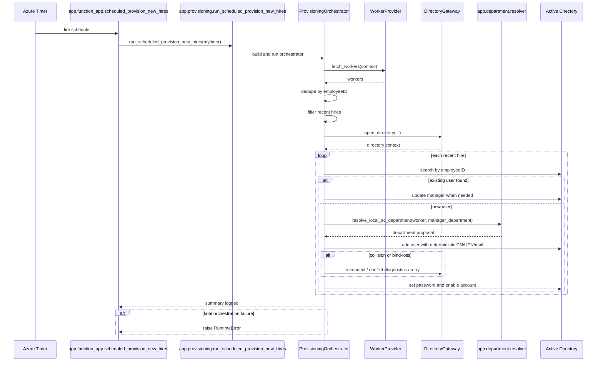
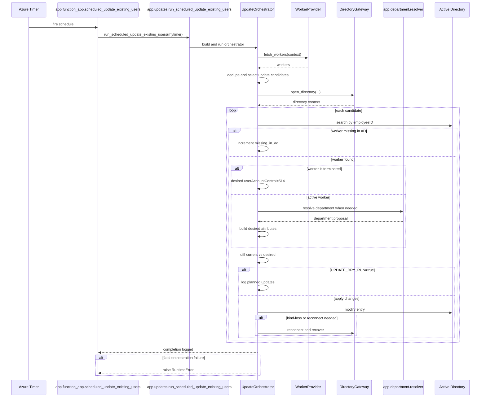
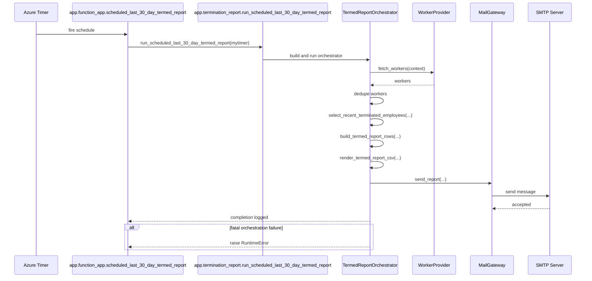
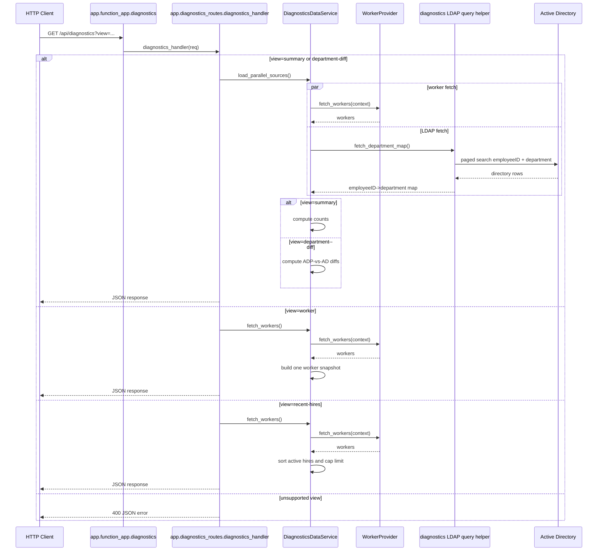

# Architecture

## System

This repository is a Python Azure Functions application that synchronizes ADP Workforce Now worker data into on-prem Active Directory over LDAPS.

The app exposes four runtime entrypoints:

- `scheduled_provision_new_hires`: provisions recent hires into AD
- `scheduled_update_existing_users`: compares ADP records to existing AD users and applies attribute updates
- `scheduled_last_30_day_termed_report`: emails a weekly CSV of recent ADP terminations
- `GET /api/diagnostics`: serves controlled diagnostics views for summary, department diffs, worker lookup, and recent hires

External integrations:

- ADP OAuth token endpoint and workers API
- LDAP / Active Directory over TLS
- SMTP for the termed report
- Azure Functions host and Application Insights logging

There is no application database in this repo. Each invocation re-fetches source data, computes a working set in memory, performs LDAP writes or emits a report, and exits.

## Runtime Model

Azure Functions discovers the root `FunctionApp` from the repo-level shim in [`function_app.py`](../function_app.py). The implementation lives in [`app/function_app.py`](../app/function_app.py).

Runtime host configuration is minimal and standard in [`host.json`](../host.json):

- Functions host version `2.0`
- Application Insights sampling
- Extension bundle `Microsoft.Azure.Functions.ExtensionBundle`

Trigger wiring is intentionally thin. [`app/function_app.py`](../app/function_app.py) binds schedules and the diagnostics route, then delegates immediately into orchestration modules.

Current schedules:

- provisioning every 15 minutes, `run_on_startup=False`
- update hourly
- termed report on `TERMED_REPORT_SCHEDULE`, default `0 0 14 * * 1`
- diagnostics exposed as `GET /api/diagnostics`

## Module Layout

### Entrypoint Layer

- [`function_app.py`](../function_app.py): Azure Functions root discovery shim
- [`app/function_app.py`](../app/function_app.py): decorated schedule and route handlers only

### Config And Type Layer

- [`app/config.py`](../app/config.py): environment parsing, defaults, and validation
- [`app/models.py`](../app/models.py): typed settings and diagnostics/domain result models
- [`app/constants.py`](../app/constants.py): LDAP attribute names, ADP HTTP defaults, update denylist, and search attribute lists

### Security And Secret Materialization

- [`app/security.py`](../app/security.py): resolves certificate and key material from env vars, supports path/PEM/base64 input, caches temp files, and cleans them up via `atexit`

### Integration Layer

- [`app/adp/`](../app/adp): focused ADP transport and parsing modules
  - [`api.py`](../app/adp/api.py): ADP auth, mTLS setup, bounded retries, and workers pagination
  - [`dates.py`](../app/adp/dates.py): worker date parsing and hire/termination extraction
  - [`identity.py`](../app/adp/identity.py): employeeID and account-string normalization
  - [`names.py`](../app/adp/names.py): legal, preferred, and display-name helpers
  - [`assignments.py`](../app/adp/assignments.py): department, manager, company, and location extraction
  - [`status.py`](../app/adp/status.py): active/inactive derivation and AD userAccountControl mapping
  - [`passwords.py`](../app/adp/passwords.py): password generation for provisioning
  - [`workers.py`](../app/adp/workers.py): compatibility export surface for legacy worker-helper imports
  - [`dedupe.py`](../app/adp/dedupe.py): duplicate-profile logging and `employeeID` dedupe
- [`app/ldap/`](../app/ldap): focused LDAP transport and directory modules
  - [`connection.py`](../app/ldap/connection.py): TLS config, server creation, bind/unbind, and transport diagnostics
  - [`directory.py`](../app/ldap/directory.py): AD lookup helpers and collision inspection
  - [`planning.py`](../app/ldap/planning.py): attribute planning, diffing, and denylist filtering
  - [`modify.py`](../app/ldap/modify.py): modify transport and reconnect recovery
  - [`updates.py`](../app/ldap/updates.py): compatibility wrapper preserving the legacy LDAP update import surface
- [`app/adp_client.py`](../app/adp_client.py) and [`app/ldap_client.py`](../app/ldap_client.py): compatibility facades that preserve legacy import paths while delegating into the split packages

### Business Rules Layer

- [`app/department/catalog.py`](../app/department/catalog.py): canonical departments, regex catalogs, and confidence constants
- [`app/department/normalization.py`](../app/department/normalization.py): normalization and confidence-label helpers
- [`app/department/signals.py`](../app/department/signals.py): ADP evidence collection across assignment payloads
- [`app/department/title_inference.py`](../app/department/title_inference.py): title-based department inference
- [`app/department/candidates.py`](../app/department/candidates.py): candidate mapping, scoring, and guardrail helpers
- [`app/department/resolver.py`](../app/department/resolver.py): Department Resolution V2 orchestration and compatibility exports
- [`app/department_resolution.py`](../app/department_resolution.py): compatibility facade for department resolution imports
- [`docs/department-resolution-v2.md`](./department-resolution-v2.md): behavior reference for department mapping rules and fallbacks

### Diagnostics Projection Layer

- [`app/diagnostics/serializers.py`](../app/diagnostics/serializers.py): read-only worker, summary, department-diff, and recent-hires payload builders
- [`app/diagnostics/__init__.py`](../app/diagnostics/__init__.py): diagnostics projection exports used by the diagnostics service

### Service Layer

- [`app/services/interfaces.py`](../app/services/interfaces.py): protocol-style gateway contracts and opened-directory context
- [`app/services/defaults.py`](../app/services/defaults.py): default ADP, LDAP, and SMTP gateway adapters built from the existing helper functions
- [`app/services/provisioning_service.py`](../app/services/provisioning_service.py): provisioning workflow orchestrator
- [`app/services/update_service.py`](../app/services/update_service.py): update workflow orchestrator
- [`app/services/termed_report_service.py`](../app/services/termed_report_service.py): termed-report workflow orchestrator
- [`app/services/diagnostics_service.py`](../app/services/diagnostics_service.py): diagnostics query service and shared projections

### Workflow Wrapper Layer

- [`app/provisioning.py`](../app/provisioning.py): thin builder and compatibility wrapper for new-hire provisioning
- [`app/provisioning_filters.py`](../app/provisioning_filters.py): recent-hire eligibility helper
- [`app/provisioning_directory.py`](../app/provisioning_directory.py): existing-user, manager, and manager-department lookup helpers
- [`app/provisioning_identity.py`](../app/provisioning_identity.py): create-time identifier and LDAP attribute planning
- [`app/provisioning_create.py`](../app/provisioning_create.py): add retry loop, collision handling, and account enablement
- [`app/provisioning_ops.py`](../app/provisioning_ops.py): provisioning create-path orchestration wrapper
- [`app/updates.py`](../app/updates.py): thin builder and candidate-selection wrapper for existing-user updates
- [`app/termination_report.py`](../app/termination_report.py): thin builder plus termed-report row/render/email helpers
- [`app/diagnostics_routes.py`](../app/diagnostics_routes.py): HTTP diagnostics controller that delegates to the diagnostics data service

### Compatibility And Test Support

- [`app/azure_compat.py`](../app/azure_compat.py): import shim so local tests can import the package when `azure-functions` is unavailable
- [`tests/`](../tests): unit and orchestration-behavior coverage aligned to the package structure
- [`tests/integration/`](../tests/integration): opt-in live smoke coverage for ADP, LDAP, SMTP, and hosted diagnostics
- [`docs/integration-tests.md`](./integration-tests.md): required env vars and run instructions for the live test layer

## Execution Flows

### Provisioning Flow

Handler path:

- [`app/function_app.py`](../app/function_app.py) -> [`app/provisioning.py`](../app/provisioning.py) -> [`app/services/provisioning_service.py`](../app/services/provisioning_service.py)

Flow summary:

1. Timer fires.
2. Fetch ADP token.
3. Fetch ADP workers and dedupe by `employeeID`.
4. Filter to recent hires inside `SYNC_HIRE_LOOKBACK_DAYS`.
5. Validate LDAP config and CA bundle.
6. Open LDAP connection.
7. For each recent hire:
   - check if user already exists by `employeeID`
   - resolve manager DN
   - resolve department via Department Resolution V2
   - build deterministic CN, `sAMAccountName`, UPN, and mail values
   - create the account with collision and bind-loss handling
   - set password and enable the account
8. Log a run summary.
9. Raise `RuntimeError` on fatal orchestration failures so the Functions host can treat the invocation as failed.

### Update Flow

Handler path:

- [`app/function_app.py`](../app/function_app.py) -> [`app/updates.py`](../app/updates.py) -> [`app/services/update_service.py`](../app/services/update_service.py)

Flow summary:

1. Timer fires.
2. Fetch ADP token.
3. Fetch ADP workers and dedupe by `employeeID`.
4. Select update candidates from ADP based on `UPDATE_LOOKBACK_DAYS`, `UPDATE_INCLUDE_MISSING_LAST_UPDATED`, and country filtering.
5. Validate LDAP config and CA bundle.
6. Open LDAP connection.
7. For each candidate:
   - search AD by `employeeID`
   - if terminated, target `userAccountControl=514`
   - otherwise compute desired attributes with LDAP planner and department resolution
   - diff desired vs current AD attributes
   - log a dry-run or apply modifications
8. Preserve create-time-only email routing identifiers by filtering them from update changes.
9. Raise `RuntimeError` on fatal orchestration failures so the Functions host can treat the invocation as failed.

### Termed Report Flow

Handler path:

- [`app/function_app.py`](../app/function_app.py) -> [`app/termination_report.py`](../app/termination_report.py) -> [`app/services/termed_report_service.py`](../app/services/termed_report_service.py)

Flow summary:

1. Timer fires.
2. Fetch ADP token.
3. Fetch ADP workers and dedupe by `employeeID`.
4. Filter to workers terminated inside `TERMED_REPORT_LOOKBACK_DAYS`.
5. Project rows for CSV output.
6. Render CSV in memory.
7. Send the email through SMTP.
8. Raise `RuntimeError` on fatal orchestration failures so the Functions host can treat the invocation as failed.

### Diagnostics Flow

Handler path:

- [`app/function_app.py`](../app/function_app.py) -> [`app/diagnostics_routes.py`](../app/diagnostics_routes.py) -> [`app/services/diagnostics_service.py`](../app/services/diagnostics_service.py)

Flow summary:

1. HTTP GET arrives at `/api/diagnostics`.
2. Query parameter `view` selects the diagnostics mode.
3. `summary` and `department-diff` fetch ADP and LDAP data in parallel.
4. `worker` and `recent-hires` fetch ADP only.
5. Results are returned as JSON with bounded, explicit response shapes.

## Data Flow

### ADP Acquisition

ADP source acquisition is implemented in [`app/adp/`](../app/adp) and exposed through [`app/adp_client.py`](../app/adp_client.py):

- token retrieval uses client credentials plus mTLS certificate material
- outbound HTTP uses bounded retries with exponential backoff
- workers are paginated with `$top` and `$skip`
- worker payloads are normalized through shared helper functions instead of repeated shape parsing

### Domain Decision Path

Department mapping is a distinct subsystem:

- provisioning uses it when creating accounts
- update sync uses it when deriving desired department changes

The resolver merges multiple evidence sources:

- cost center description
- assigned and home departments
- manager department
- title inference
- occupational classifications
- legacy department signals

It then applies canonical mapping, admin gating, manager-alignment guardrails, and fallback behavior.

### LDAP Write Path

LDAP writes are staged rather than done ad hoc:

1. derive desired attributes
2. diff against current entry state
3. filter prohibited changes
4. apply modify operations with bind-loss recovery

Create-time-only email routing attributes are defined in [`app/constants.py`](../app/constants.py) and filtered out of update mutations in [`app/ldap/updates.py`](../app/ldap/updates.py).

The identity anchor is `employeeID`:

- provisioning uses it to determine whether a user already exists
- updates use it as the primary AD lookup key
- diagnostics uses it for worker correlation and ADP-vs-AD comparisons

## Config And Secrets

The configuration model is fully environment-driven.

- [`app/config.py`](../app/config.py) parses booleans, integers, CSV lists, and required env sets
- [`app/models.py`](../app/models.py) defines typed settings objects
- [`local.settings.example.json`](../local.settings.example.json) provides the committed local template

Secret-backed file handling is centralized in [`app/security.py`](../app/security.py):

- `ADP_CERT_PEM` and `ADP_CERT_KEY` can be file paths, PEM text, or base64 payloads
- LDAP and ADP CA bundles resolve explicitly, with `certifi` fallback
- temp cert files are tracked and cleaned deterministically
- secret payload content is not logged

## Tests, CI, And Deployment

### Tests

The test suite in [`tests/`](../tests) is organized by subsystem and covers:

- config/env parsing
- ADP retry behavior
- diagnostics route modes
- provisioning collision logic
- update diff and denylist behavior
- department resolution rules
- secret materialization and cleanup
- termination report selection and email orchestration

There is also an opt-in live integration layer under [`tests/integration/`](../tests/integration):

- ADP token and workers fetch smoke
- LDAP bind and search smoke
- SMTP send smoke for the termed report
- Azure-hosted diagnostics contract smoke

The live layer skips by default and only runs when the required environment variables are present. See [`docs/integration-tests.md`](./integration-tests.md).

The live suite now includes a separately gated end-to-end update workflow smoke test with `dry_run=True`. That exercises the scheduled update path without enabling live write behavior.

### CI

Verification is defined in [`verify.yml`](../.github/workflows/verify.yml):

1. install dependencies
2. run `pytest -q`
3. run `py_compile`
4. run `ruff`
5. run `mypy`

### Deployment

Deployment is defined in [`main_adp-to-azuread.yml`](../.github/workflows/main_adp-to-azuread.yml).

The workflow now builds a curated `release.zip` that contains only runtime payload:

- `function_app.py`
- `host.json`
- `requirements.txt`
- `app/**`

That artifact is deployed directly to the Azure Function App `adp-to-azuread`.

Manual publish remains possible via Azure Functions Core Tools, with publish hygiene supported by [`.funcignore`](../.funcignore).

## Operational Characteristics

- The architecture is stateless and polling-oriented.
- Each timer run is independent and re-fetches external state.
- ADP resilience is concentrated in bounded retry logic and worker dedupe.
- LDAP resilience is concentrated in reconnect and bind-loss recovery.
- `UPDATE_DRY_RUN` defaults to `true`, which makes update behavior safe by default.
- Diagnostics is read-only and exposes only explicit supported views.
- Fatal timer-path failures now raise exceptions instead of being treated as successful no-op invocations.

Primary failure boundaries:

- ADP auth failure
- ADP workers fetch failure
- LDAP connect/search/modify/add failure
- SMTP send failure

## Design Strengths

- Trigger wiring is cleanly separated from orchestration logic.
- Transport/integration concerns are separated from domain rules.
- Department logic is explicit and documented rather than hidden in procedural branches.
- Update guardrails prevent accidental mutation of create-time-only routing identifiers.
- Shared ADP parsing helpers reduce payload-shape duplication across jobs and diagnostics.
- CI now validates the same package layout that gets deployed.

## Current Tradeoffs

- The old public module names remain in place as compatibility facades for external imports and test seams, but internal application code now imports the split packages directly.
- The previous single-file hotspots are now split across focused helper modules. The densest remaining logic is mostly in [`app/provisioning_create.py`](../app/provisioning_create.py), [`app/adp/assignments.py`](../app/adp/assignments.py), and [`app/department/candidates.py`](../app/department/candidates.py), where the domain complexity still naturally lives.
- The directory gateway now owns update-path employee lookup, department lookup, and change application. The remaining live LDAP connection exposure is concentrated in the create-user path used by provisioning operations.
- The live integration layer now covers transport smoke plus a gated update-workflow dry run, but it is still intentionally not a full write-path end-to-end suite.
- Diagnostics projections now live in their own package, which reduces route/service duplication. Some shared helper coupling remains because diagnostics and workflows still consume the same ADP and department-domain rules.

## Extension Points

- To add a new job:
  - wire the handler in [`app/function_app.py`](../app/function_app.py)
  - add typed settings in [`app/models.py`](../app/models.py)
  - parse env in [`app/config.py`](../app/config.py)
  - add or extend a gateway/orchestrator in [`app/services/`](../app/services)
  - add tests under [`tests/`](../tests)
- To change synced AD attributes:
  - update [`app/constants.py`](../app/constants.py)
  - update planning logic in [`app/ldap/planning.py`](../app/ldap/planning.py)
  - update modify/recovery behavior in [`app/ldap/modify.py`](../app/ldap/modify.py)
- To evolve department mapping:
  - update [`app/department/catalog.py`](../app/department/catalog.py), [`app/department/candidates.py`](../app/department/candidates.py), and [`app/department/resolver.py`](../app/department/resolver.py)
  - keep [`docs/department-resolution-v2.md`](./department-resolution-v2.md) aligned
  - update [`tests/test_department_resolution.py`](../tests/test_department_resolution.py)
- To add diagnostics views:
  - extend `SUPPORTED_DIAGNOSTICS_VIEWS`
  - add route branching in [`app/diagnostics_routes.py`](../app/diagnostics_routes.py)
- To add more report sinks:
  - extend the selection -> row building -> render -> transport pipeline in [`app/termination_report.py`](../app/termination_report.py)

## Sequence Diagrams

### Provisioning Timer

### Update Timer

### Weekly Termed Report Timer

### Diagnostics Route

